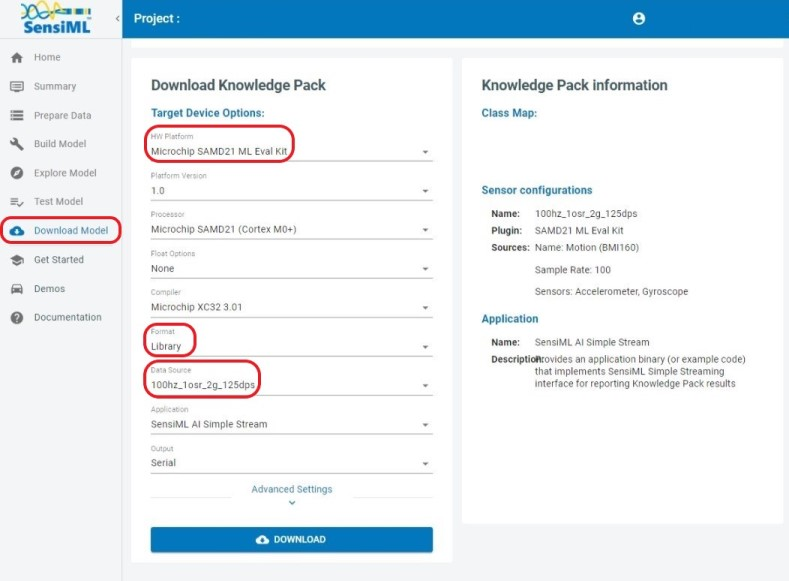
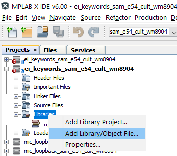
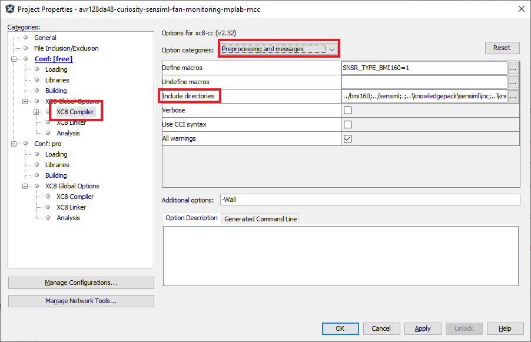
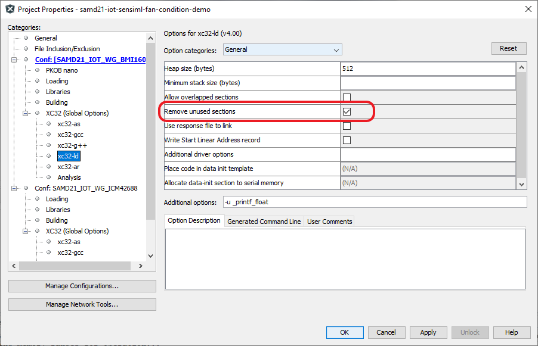

# SensiML Project Builder
This repository contains instructions for creating a library object from an
[SensiML Analytics Studio](https://sensiml.com/products/analytics-studio/) project for any xc32
supported platform.

Notes:
- This script has only been tested under linux (ubuntu), [Git
  Bash](https://gitforwindows.org/), and macOS.
- `*.options.ini` can be modified to set additional project options; for help
  call the mplab script `prjMakefilesGenerator -setoptions=@ -help`
  + NB: all relative paths are considered relative to the project root folder
    (.X folder)
- `*.project.ini` is just a placeholder - the **languageToolchain** and
  **device** variables are replaced when building the project - others will take
  default values if unspecified.

## Software Used
* MPLAB® X IDE *>=6.00* (https://microchip.com/mplab/mplab-x-ide)

## Model Deployment
To deploy a knowledge pack for the SAMD21 ML Eval Kit:

1. Open up your SensiML project in the [Analytics Studio](https://app.sensiml.cloud/) and navigate to the *Download Model* tab.
2. Select `Microchip SAMD21 ML Eval Kit` from the *HW Platform* options.
3. Select one of *Binary*, *Library* or *Source* from the *Format* options. *Note: source format is only available for upper tier customers*.
4. Select the appropriate sensor configuration for your project from the *Data Source* options. Note that this configuration should match the one you used to capture the data your model was trained with.
5. Click the *Download* button to download the model.

|  |
| :--: |
| Deployment from the Analytics Studio |

## SensiML SDK Build Instructions
The following steps cover compiling the SensiML library into a static library object.

1. Extract the library from the step above directly into this folder.

2. (Optional) Open `options.ini` and modify C as needed.

3. Set the environment variables `MPLABX_VERSION XC_NUMBER_BITS XC_VERSION` as
   desired, then run `build.sh` to generate the library object. For example:

   `./build.sh ATSAME54P20A libsensiml .`

## Docker Build
To launch a Docker build for a specific target build arguments must be set as
shown in the included example `.args` files. See `docker_build.sh` for a full
example for building the docker image and generating the SensiML
library/project. To run the script with non-default arguments, just set the
corresponding variables in your environment e.g.:

```bash
PRJ_TARGET=ATSAME54P20A BUILD_ARGS_FILE=./SAME54.args PRJ_BUILD_LIB=1 ./docker_build.sh
```

This will output the result of the build into a folder `dist/` under your current working directory.

See [packs.download.microchip.com](https://packs.download.microchip.com/) for
device family pack listings.

## Integration Instructions
Below are instructions for integrating the library object, compiled with the
steps above, into an MPLAB X project.

1. Add the library object from the step above into an existing MPLAB project as
   shown below.

   

2. Use `src/main.c` as a template for integrating the SensiML library
   into your project.

3. Add the path to the directory where the SDK is extracted in your include path
   under *Project Properties* -> *xc32/16/8-gcc* -> *Preprocessing and messages* -> *Common include dirs*

   

4. Ensure that the `Remove unused sections` option under *Project Properties* ->
   *xc32-ld* is enabled (see (2) in the image below); this will eliminate any
   unused data or functions from the SDK to reclaim device memory.

   

You should now have your SensiML model fully integrated with an MPLAB X project.
In order to update the deployed model, simply repeat the steps from the [build
instructions](#sensiml-sdk-build-instructions) section above.

