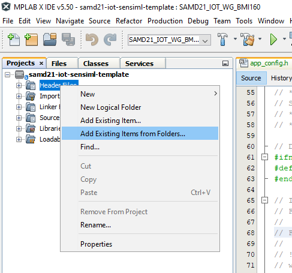
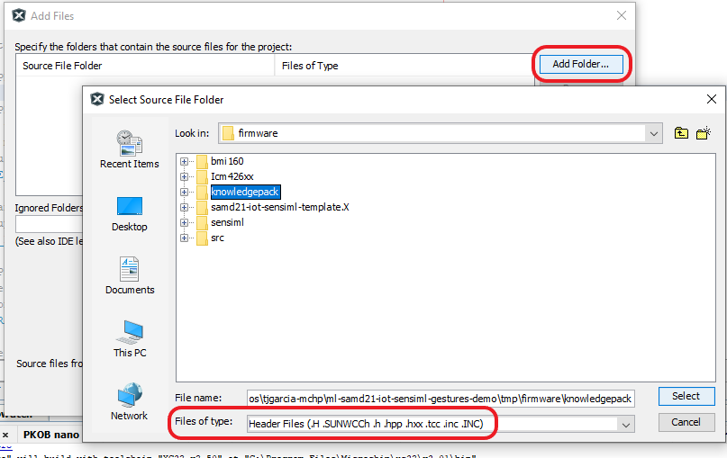

# SensiML Project Builder


# Contents

<!-- no toc -->
- [Overview](#overview)
- [Knowledge Pack Deployment](#knowledge-pack-deployment)
- [Knowledge Pack Library Compilation](#knowledge-pack-library-compilation)
- [Knowledge Pack Integration](#knowledge-pack-integration)
- [Knowledge Pack API](#knowledge-pack-api)

<div style="page-break-after: always;"></div>

# Overview
This repository contains instructions for deploying a SensiML [SensiML Analytics
Studio](https://sensiml.com/products/analytics-studio/) project to any xc8,
xc16, or xc32 supported platform. Users of the SAMD21 ML Eval Kit (i.e.
[EV45Y33A](https://www.microchip.com/developmenttools/ProductDetails/EV45Y33A)
or
[EV18H79A](https://www.microchip.com/developmenttools/ProductDetails/EV18H79A))
should visit the [SAMD21 SensiML
Template](https://github.com/MicrochipTech/ml-samd21-iot-sensiml-template)
repository which contains a complete firmware implementation.

## Software Used
* MPLAB® X IDE (https://microchip.com/mplab/mplab-x-ide)

<div style="page-break-after: always;"></div>

# Knowledge Pack Deployment
To deploy a knowledge pack from the SensiML Analytics Studio:

1. Open up your SensiML project in the [Analytics Studio](https://app.sensiml.cloud/) and navigate to the *Download Model* tab.

2. Select `Microchip SAMD21 ML Eval Kit` from the *HW Platform* options.

   - *Although SAMD21 ML Eval Kit is specified as the hardware platform, the
   *Source* format option will generate code that should be compatible with any
   xc compiler platform.*

3. Select one of *Binary*, *Library*, or *Source* from the *Format* options.

   - Note that the *Source format is only available for upper tier SensiML
     customers*.

4. Select the appropriate sensor configuration for your project from the *Data
   Source* options.

   - *Note that this configuration should match the one you used to capture the
   data your model was trained with.*

   - *This step is only relevant for the SAMD21 ML Eval Kit - in all other cases
   you will have to manually verify your sensor configuration*

5. Click the *Download* button to download the model.

   |  |
   | :--: |
   | Deployment from the Analytics Studio |

<div style="page-break-after: always;"></div>

# Knowledge Pack Library Compilation
The following steps cover the process of manually compiling the SensiML source
code into a static library object. This step is not required for integration,
but is typically less problematic than integrating source code directly.

## Using `build.sh`

1. (*For Windows users only*) Install [Git Bash](https://gitforwindows.org/).

2. Install MPLAB X version 6.00 or greater.

3. Install a DFP for the target device family (e.g. AVR-Dx). DFPs can be
   installed from MPLAB X or manually from
   https://packs.download.microchip.com/.

4. Extract the library archive from the step above directly into this folder.
   The zip file should contain a folder named `knowledgepack` where the SensiML
   source code is located.

5. (Optional) Open `options.ini` and modify as needed.

6. Set the environment variables `MPLABX_VERSION XC_NUMBER_BITS XC_VERSION` as
   desired, then run `build.sh` to generate the library object. For example:

   `MPLABX_VERSION=6.00 XC_VERSION=4.00 XC_NUMBER_BITS=32 ./build.sh ATSAME54P20A libsensiml .`

   > *By default `build.sh` will select the latest program versions found on
   > your system in the default install locations. If MPLAB X or the XC compiler
   > are in non-default install locations, manually set the corresponding path
   > directly through the `MPLABX_PATH` and/or `XC_PATH` environment variables.*

7. See the [integration instructions](#knowledge-pack-integration) below to
   integrate the library with your MPLAB X project.

## Using Docker
For convenience, `docker_build.sh` is provided which contains a full example for
building the docker image and generating the SensiML library/project. This
script can be run by passing the target name and the corresponding .args file e.g.:

```bash
./docker_build.sh ATSAME54P20A args/SAME54.args
```

The output of the build process will be placed in a folder named `dist/` under
your current working directory.

Note: The `.args` files included in this repository may not always be up to
date. Check
[packs.download.microchip.com](https://packs.download.microchip.com/) for the
most up to date device family pack listings.

## Usage Notes
- `*.options.ini` can be modified to set additional project options; for help
  call the MPLAB script `prjMakefilesGenerator -setoptions=@ -help`
  + NB: all relative paths are considered relative to the project root folder
    (.X folder)
- `*.project.ini` is just a placeholder - the **languageToolchain** and
  **device** variables are replaced when building the project - others will take
  default values if unspecified.

<div style="page-break-after: always;"></div>

# Knowledge Pack Integration

## Binary Format
*At the time of this writing this option is only supported for the SAMD21 ML Eval Kit*

If you deployed a knowledge pack in the *Binary* format, the archive should
contain the binary file which can be written directly to the evaluation board.

## Library Format
Below are instructions for a SensiML library object into an MPLAB X project. For
guidance on compiling source code into a library object refer to [Knowledge Pack
Library Compilation](#knowledge-pack-library-compilation).

1. Add the library object from the step above into an existing MPLAB project as
   shown below.

   

2. Extract the SensiML deployment archive somewhere into your project
   directory.

3. Add the path to the `inc` folder from the SensiML deployment archive (e.g.
   `../knowledgepack/sensiml/inc`) into your XC compiler include path in the
   *Project Properties*.

   

## Source Format
Follow the steps below to directly integrate the SensiML source code into your
MPLAB X project. Alternatively, you may use the included build scripts to [build
the source code into a library object](#knowledge-pack-library-compilation)
before integration.

1. In MPLAB X, open up the .X project folder under the `firmware` folder of this repository.

2. In the *Projects* pane, right click the *Header Files* folder and select *Add
   Existing Items from Folders* from the options.

   |  |
   | :--: |
   | Adding knowledge pack header files to your project |

3. In the resulting window that opens, click the *Add Folder* button.

4. In the new dialog, select *Header Files* from the *Files of Type* dropdown,
   then navigate to the project's `firmware` directory and select the
   `knowledgepack` directory. Click the *Select* button to add the directory.

   |  |
   | :--: |
   | Recursively add header files (.h) under the `knowledgepack` folder |

5. Back in the *Add Files* window, click the *Add* button to finish adding the
   necessary header files and close the dialog.

6. Right click the *Source Files* folder in the *Projects* pane and select *Add
   Existing Items from Folders* from the menu. Repeat steps 4-6 to add all
   source files (.c files) from the `knowledgepack` folder.

7. Add the path to the `inc` folder from the SensiML deployment archive (e.g.
   `../knowledgepack/sensiml/inc`) into your XC compiler include path in the
   *Project Properties*.

<div style="page-break-after: always;"></div>

# Knowledge Pack API
Once the library has been integrated, you just need to add a few hooks into your
project to perform inferencing with the SensiML model's API; the `src/main.c`
file provides a skeleton implementation which you can use as a template for your
own project.

For more detailed information on the SensiML API visit the [SensiML
Documentation](https://sensiml.com/documentation/knowledge-packs/building-a-knowledge-pack-library.html#calling-knowledge-pack-apis-from-your-code).
